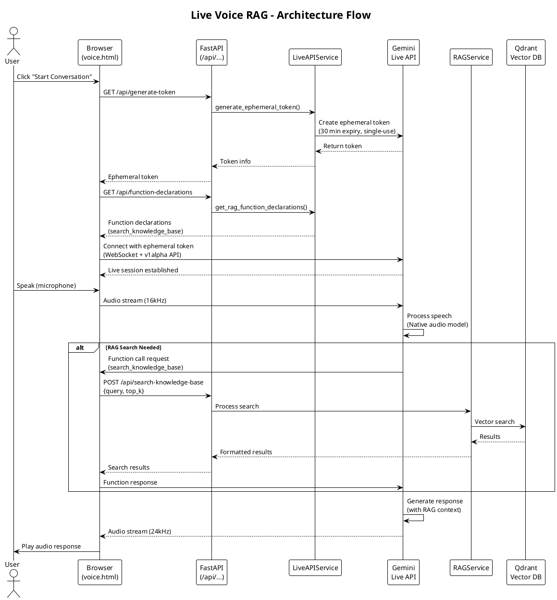

# Info Folder

This folder contains documentation, API collections, and configuration templates for the DevKraft RAG system.

## Contents

### 📮 Postman Collection Files

#### `rag.postman_collection.json`
Complete Postman collection with all API endpoints. Includes:

- **Health Check Endpoints**
  - `GET /` - Root health check
  - `GET /health` - Detailed health status

- **Query Endpoints**
  - `POST /query` - RAG query with Gemini model
  - `POST /query` - RAG query with Qwen3 local model
  - `POST /query` - RAG query with chat history continuation
  - `POST /query-stream` - Streaming RAG query (Gemini)
  - `POST /query-stream` - Streaming RAG query (Qwen3)

- **Document Management**
  - `POST /upload` - Upload and ingest a document
  - `POST /ingest-all` - Bulk ingest all documents

- **Chat History**
  - `GET /chats?limit=10` - Get recent chat sessions
  - `GET /chat/{chat_id}` - Get full chat history

- **Text to Speech**
  - `POST /tts` - Convert text to audio (WAV)

- **Website Ingestion**
  - `POST /ingest-website` - Ingest content from a website URL

- **Live API (Voice Interface)**
  - `GET /voice` - Access Live Voice RAG interface
  - `GET /api/generate-token` - Generate ephemeral token for Live API
  - `GET /api/function-declarations` - Get RAG function declarations
  - `POST /api/search-knowledge-base` - Search knowledge base (tool function)

**Usage:**
1. Open Postman
2. Import `rag.postman_collection.json`
3. All requests are pre-filled with example data
4. Update the `base_url` variable if needed (default: `http://localhost:8000`)

#### `rag.postman_environment.json`
Environment variables for the Postman collection:
Currently API Keys are managed by app\config.py, no need to put in Postman

- `base_url` - API base URL (default: `http://localhost:8000`)
- `gemini_api_key` - Gemini API key (replace `****` with actual key)
- `qdrant_api_key` - Qdrant API key (replace `****` with actual key)
- `hf_token` - HuggingFace token (replace `****` with actual key)
- `mongo_uri` - MongoDB connection string (replace `****` with actual URI)
- `qdrant_cloud_url` - Qdrant Cloud URL
- `qdrant_docker_url` - Qdrant Docker URL
- `lmstudio_url` - LM Studio URL
- `qdrant_cloud_collection` - Cloud collection name
- `qdrant_docker_collection` - Docker collection name

**Usage:**
1. Import `rag.postman_environment.json` into Postman
2. Select "DevKraft RAG Environment" from the environment dropdown
3. Replace all `****` placeholders with your actual API keys
4. Save the environment

### ⚙️ Configuration Template

#### `.env.example`
Template for environment variables. Copy this file to the project root as `.env` and fill in your actual values:

```bash
# Copy this file to the project root and rename to .env
cp info/.env.example ../.env

# Then edit the .env file with your actual API keys
```

Required variables:
- `GEMINI_API_KEY` - Google Gemini API key
- `QDRANT_API_KEY` - Qdrant Cloud API key
- `HF_TOKEN` - HuggingFace API token
- `MONGO_URI` - MongoDB Atlas connection string

### 🏗️ Architecture Diagram

#### `architecture-simple.puml`
PlantUML diagram showing the complete system architecture.

**Components:**
- Entry Points (Streamlit UI, FastAPI, startup script, Live Voice Interface)
- Configuration management
- Core Services (embeddings, LLM, storage, TTS, Live API)
- Business Services (RAG, ingestion, document processing)
- External integrations (Gemini, Qdrant, MongoDB, HuggingFace, LM Studio)
- Runtime folders (documents, chat history, logs)

**View the diagram:**
- Use PlantUML viewer/extension in your IDE
- Online: Copy content to http://www.plantuml.com/plantuml/uml/
- VS Code: Install PlantUML extension

#### `DevKraft_RAG_Architecture.png`
Generated architecture diagram image from the PlantUML source.

### 🎤 Live Voice RAG Frontend

The `static/` folder contains the Live Voice RAG interface using Gemini Live API.

**Files:**
- `voice.html` - Main HTML page for the voice interface
- `voice.js` - JavaScript client using `@google/genai` SDK
- `voice.css` - Styling for the voice interface
- `package.json` - Optional NPM config for local SDK installation

**JavaScript SDK:**

By default, the SDK is loaded from the ESM CDN (no installation required):
```javascript
import { GoogleGenAI, Modality } from 'https://esm.run/@google/genai';
```

**Alternative: Local Installation** (if CDN is blocked by ad blockers or firewalls):
```bash
cd static
npm install
```
Then modify the import in `voice.js`:
```javascript
import { GoogleGenAI, Modality } from '/static/node_modules/@google/genai/dist/index.mjs';
```

**Note:** The `node_modules` directory is in `.gitignore` and won't be committed.

**How It Works:**

1. **Ephemeral Token Authentication**: Backend generates short-lived tokens via `/api/generate-token`
2. **SDK Connection**: Frontend uses `GoogleGenAI` client with the ephemeral token
3. **Live Session**: Establishes bidirectional audio streaming with Gemini Live API
4. **Function Calling**: Model can call `search_knowledge_base` to access RAG data
5. **Real-time Audio**: Native audio input (16kHz) and output (24kHz) without text conversion

**Security:**
- ✅ No API keys in frontend code
- ✅ Ephemeral tokens with 30-minute expiry
- ✅ Single-use tokens for each session
- ✅ Client-to-server architecture (no backend audio proxy)

**Browser Requirements:**
- Modern browser with Web Audio API support
- Microphone access permissions
- WebSocket support
- ES6 modules support

#### Live API Architecture Diagram




## Quick Start

1. **Set up environment:**
   ```bash
   cp info/.env.example .env
   # Edit .env with your API keys
   ```

2. **Import Postman files:**
   - Import `rag.postman_collection.json`
   - Import `rag.postman_environment.json`
   - Update environment variables with actual keys

3. **Start testing:**
   - Start the FastAPI server: `uvicorn app.main:app --reload`
   - Open Postman and start making requests

## Notes

- All Postman requests have pre-filled example data
- The environment file uses `****` as placeholders for security
- Never commit actual API keys to the repository
- The architecture diagram provides a comprehensive overview of the system
